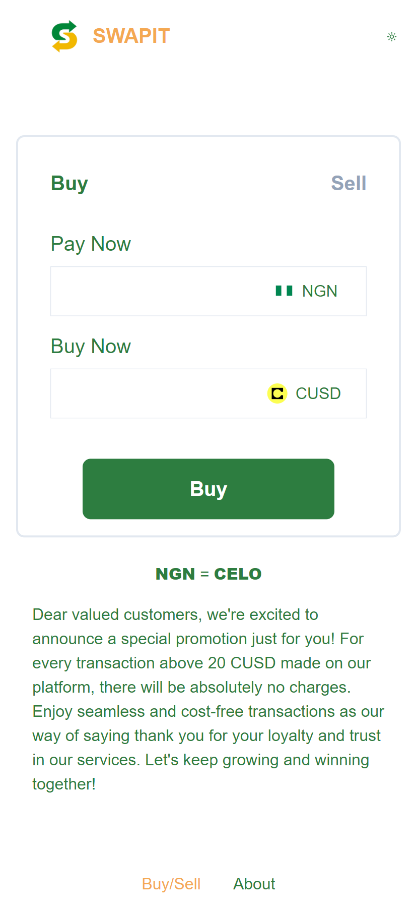

# SwapIt

This Project is for Celo Hackathon Season 7

### Description

In Nigeria, people once enjoyed the ease of swapping their cryptocurrency for Naira. However, due to new government regulations on crypto, this process had become increasingly difficult. Nigerians now found themselves struggling to convert their digital assets (CUSD) into the local currency. Creating the SWAPIT app is now a way to make converting CUSD to Naira easier and more convenient for Nigerians.

## Problems

Difficulty in maintaining the relationships with traditional banks as many banks are caution about dealing with cryptocurrency business.
Difficulties for Nigerians to convienently swap cryptocurrency for Naira. Financial risk such as fraud, money laundering and market manipulation.

## Solutions

Creating an avenue for Nigerians to convienently swap their cryptocurrency to Naira.
Implementing advanced fraud detection systems to identify and prevent fraudulent activities.
Establishing relationships with crypto friendly banks and financial institutions.

## Methodology

### Short description

SwapIt is a user friendly platform that simplifies the process of converting cryptocurrencies to fait (Naira) and charges no fees for transactions over 20 CUSD.

### How it was made

This project was made using Next.js for the frontend. Connectiing with my smart contract was done using Wagmi, ethers, viem and wallet connect.

### Tools

- Next.js, React, Wagmi, Solidity, Remix, Typescript, ethers, viem.

### Languages

- Typescript, Solidity, JavaScript.

### Frameworks used

- Next.js, Solidity, Wagmi, ethers, viem, radius-ui, @rainbow- me, @celo/rainbowkit-celo, @headlessui/react.

### Instructions

- Clone the repository from github
- Run `npm install` to install all packages
- Run `npm run dev` to start the Next.js server

### Screenshots

### Links

- [Github link](https://github.com/Preciousnnebuogor/Swapit)
- [Vercel link](https://swapit-eta.vercel.app/)
- [Video link] ()
